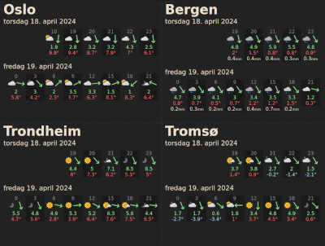
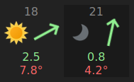

# 2024 Weather Forecast

https://lysebo.xyz/misc/weather

Weather data from places of interest. All in one grid.



Playing around with a weather API, fetch, localStorage


# API from met.no

The Norwegian Meteorological Institute (MET) provides open access to weather data
- https://api.met.no/weatherapi/locationforecast/2.0/documentation
- https://api.met.no/doc/locationforecast/datamodel

An example endpoint for the API is 
```
https://api.met.no/weatherapi/locationforecast/2.0/compact?lat=XXX&lon=YYY
```

Latitude and longitude can be found in many ways, for example by right-clicking the point of interest in Google Maps.

The weather data from the API is an array of hourly data for the next number of days. The first days have a complete set of data for every hour, making it easy to create an overview. The long-term forecast does not necessarily include all the hours of the day, but rather have 3, 6 or 12 hour estimates on the values, making it a little more tricky to structure.

There is also a repo of images for each weather symbol returned by the API  
https://github.com/metno/weathericons

And even a repo of warning icons. I did not use these  
https://github.com/nrkno/yr-warning-icons

Here is a nice article about API calls in javascript  
https://www.freecodecamp.org/news/make-api-calls-in-javascript/

# Overview

The locations of interest are defined in the array `conf.locations`. Each location has latitude, longitude and a label. The weather data is fetched, and a `container` is rendered and finally injected on the page. The `MET` class handles most of the logic.

Data is saved in localStorage together with a timestamp, and identified by the label. When the page attempts to get new data, the timestamp is checked. If we're still within the same hour, the local data is used again. If the hour has changed, a new request is sent to the API.

I wanted this to work on an old iPad which struggles to reload web pages that are added to the home screen. Safari only reloads if the `index.html` has changed. If one of the other files have changed, nothing happens. Pull down to refresh has no effect either. To fix this I added an interval that triggers a refresh of the different sections. If the local data has expired, a new set of data is fetched.

# Today

Each day has space for 8 slots of data. The default set of hours is 0, 3, 6, 9, 12, 15, 18 and 21 o'clock.
```
    0    3    6    9   12   15   18   21
```

If we load the page at 9 o'clock we don't want to see the previous hours, but we want to see as many hours possible for the remainder of the day. And we want the list to include as many hours as possible from the current time. Such as this:
```
    9   10   11   12   13   15   18   21
```

The hours 10, 11 and 13 have been added, making the list consist of 8 time slots. The `renderDay()` function in the `MET` class has some calculations for this.

# Wind direction Arrows



The wind direction arrows are not a part of the weather icon repo, but rather a single SVG arrow that is rotated according to the wind direction. The arrow is defined once, and the rotation is applied as inline CSS to every arrow element
```
<span class="arrow" style="transform: rotate(${el.wind_from_direction}deg)"></span>
```

# CSS

Mobile first. All the locations are listed one after the other. On larger screens the sections are presented as a 2x2 grid. There is also a max with where the content stops growing, and a minimum width that locks the width.

Making this work on an older iPad made feature detection necessary. That's a very convenient way of querying if a given feature is supported or not.
```
@supports (aspect-ratio: 1) {}
@supports not (aspect-ratio: 1) {}
```

The downside of supporting older browsers was to (temporarily) abandon nested CSS. I didn't bother adding a preprocessor this time.

Some precise nth-child querying is always nice, such as `border-right` on the left elements in the grid:
```
section:nth-child(odd) {
  border-right: 1px dashed var(--border-color);
}
```
or `border-bottom` only on the first two elements in the grid:
```
section:nth-child(-n + 2) {
  border-bottom: 1px dashed var(--border-color);
}
```
